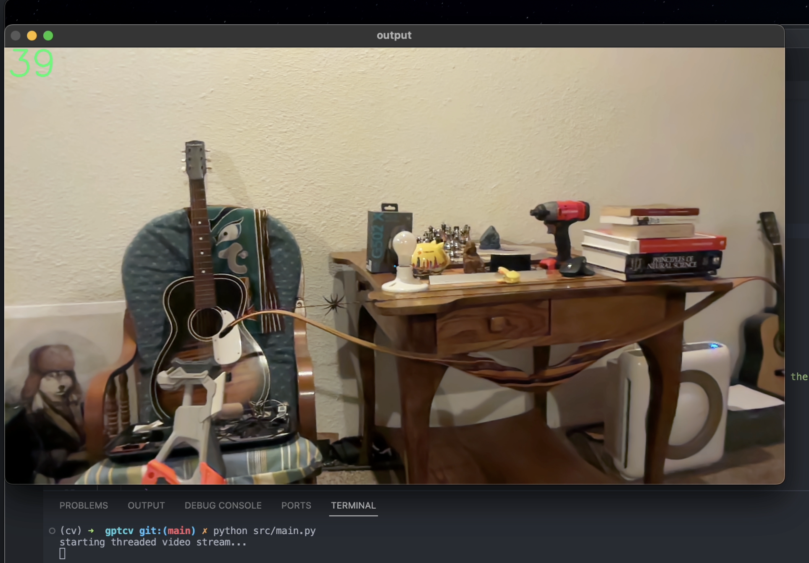
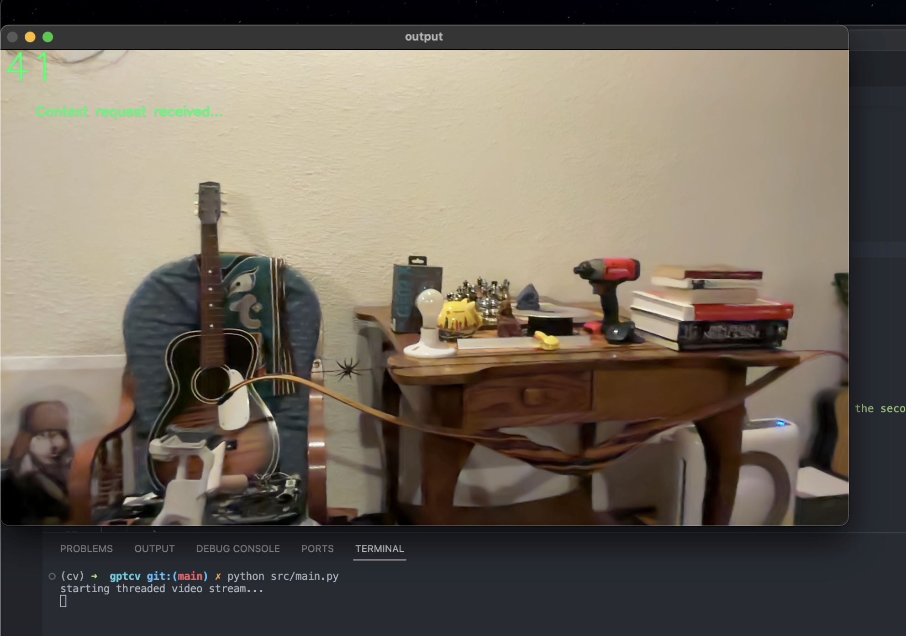
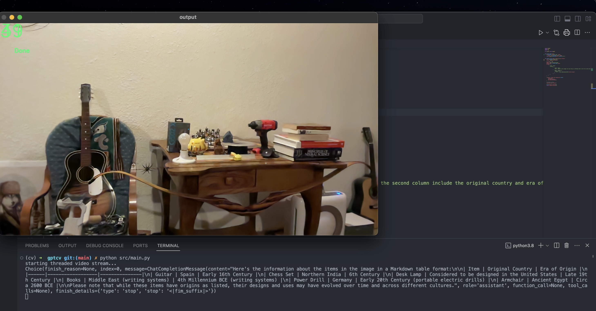

# Using OpenAI GPT-4 Vision Model with OpenCV


*Learn how to setup requests to OpenAI endpoints and use the  `gpt-4-vision-preview` endpoint with the popular open-source computer vision library `OpenCV`* 

---

### What We're Doing
---

Simply put, we are building a software application that:

- Displays a webcam feed.
- Detects objects in the frame of the video feed.
- Allows capturing a screenshot from the video.
- Encodes the captured frame.
- Sends the encoded image data to OpenAI's `gpt4-vision` model to be analyzed against a prompt we will include with the request.

The simple example prompt used for this tutorial asks for the original country and era of origin for all objects found in an image be listed in a Markdown table. This image will be the screenshot taken from the stream of frames for the video.

[🫒 Get The Code 🫒](https://github.com/skyneticist/gpt-cv)

###### Prerequisites

The only things you need to have ahead of time is:

 1. An internet connection to download two dependencies and to send our request to the OpenAI endpoint.
 2. Python installed on your machine. It should be some version of Python3.
 3. An active OpenAI paid API subscription key.

---
### Installing Dependencies
----

#### Using Requirements.txt File

It is common practice with Python projects to include a `requirements.txt` file for conveniently installing the modules the project depends on. <br><br> If you open up `requirements.txt` for the `gptcv` project, there should be two dependencies listed with their targeted version:

**`requirements.txt`**

```
openai==1.3.5
opencv-python==4.7.0.72
```

This is nice since we can simply run the following command in a terminal and have all dependencies downloaded and installed:

```bash
# Install all dependencies defined in requirements.txt
pip install  -r ./requirements.txt
``` 

**Otherwise**, it is a matter of running a separate `pip install` for each module needed.

```bash
pip install openai
pip install opencv-python
```

###### Testing Dependencies

Let's quickly make sure our required modules were successfully installed.

Run these commands in a terminal:

``` Bash
python
```
*^ This command opens a Python editor in the terminal*

```bash
import cv2
```
*^ This command imports OpenCV package into terminal editor environment*

You shouldn't see any ouput. Now let's do the same thing for the OpenAI module.

```bash
import openai
```
If no errors appeared in the terminal, we can assume the two modules were installed successfully and ready for us to use.

---
## Making Requests to OpenAI
---

Fortunately making requests to OpenAI endpoints in Python is incredibly simple.

#### OpenAI Python Package

```python
from openai import OpenAI

client = OpenAI()
client.api_key="<YOUR_API_KEY_GOES_HERE>"

model = ""
messages = []
max_tokens = 350

response = client.chat.completions.create(
    model,
    messages,
    max_tokens,
)
```

**Instantiating OpenAI Client**

On the first line we are importing the `OpenAI` object from the `openai` module we installed earlier.

```python
from openai import OpenAI
```

We import this so we can invoke it and set up a client that can be used to intereact with OpenAI.

```python
# grab the key from an environment variable
client = OpenAI()
```

**Setting Your OpenAI Subscription Key**

The `client` object is used to set the client's `api_key` property value to your paid OpenAI API subscription key.

Note that it is best practice to NOT hardcode your api key anywhere in your source code. 

An environment variable should be set instead. Then the key can be fetched from a call using `os` Python module.

###### Setting Environment Variable

Execute the following command in a terminal:
```bash
export OPENAI_KEY="PUT_KEY_HERE"
```

###### Fetch Key From Environment

Back in our code:

```python
key = os.getenv("OPENAI_KEY")
client = OpenAI(api_key=key)
```

Be mindful when sharing any code, especially when pushing to Github--make sure to remove any sensitive information like your OpenAI API key or switch to fetching it from your machines environment as just mentioned.

**Sending Request With OpenAI Client**

Now that the `client` object has a valid subscription key set to its `api_key` property, we are set to make a call to the `gpt-4-vision-preview` model.

We need to setup our request variables with meaningful content. These variables will be passed to a method on our `client` object responsible for creating the request and fetching the response.

```python
# OpenAI model to use for the request
model = "gpt-4-vision-preview"

# Maximum amount of tokens you want to use for this request
max_tokens = 300

# List of message objects that contains the actual queries
messages = [
    {
        "role": "user",
        "content": [
                {
                    "type": "text",
                    "text": "What’s in this image?\n List each thing in a Markdown table in the first column and in the second column include the original country and era of origin for the idea behind each item found."
                },
                {
                    "type": "image_url",
                    "image_url": {
                        "url": f"data:image/jpeg;base64,{base64_image}",
                    },
                },
        ],
    }
]
```
---

###### model 

Specifies the OpenAI LLM model to use for the Completions request. Another example is `gpt-4`.

---

###### max_tokens

Limits the maximum tokens used for the request. This includes both input and output, so prompt size should be considered.

---

###### messages

A list of message objects to send to the completions endpoint for the model specified. 

Each message object should have a `role` and `content` properties
set to appropriate values. 

***role***

The `role` includes OpenAI roles such as `user` and `system`.

***content***

The `content` property is a list of content to pass as queries to the model.

In our case, the content list has two items, each being an object with two parameters. The first parameter is always `type`. Additional parameters are determined by what `type` of content you are wanting to send. 

As you can see, we are specifying `text` for our first content object and `image_url` for the second. The first object is specified as text since we want to pass a prompt with our encoded image data.

```python
{
    "type": "text",
    "text": "What’s in this image?\n List each thing in a Markdown table in the first column and in the second column include the original country and era of origin for the idea behind each item found."
},
```

This chat prompt asks GPT to determine what is in the image, what is the original Country and Era of origin for each object, and generate a Markdown table listing the items with their era and origin.

The encoded image data is passed along in our second `content` object with the `image_url` being set to the data type and the base64 encoded image appended.

```python
{
    "type": "image_url",
    "image_url": {
        "url": f"data:image/jpeg;base64,{base64_image}",
    },
},
```

---

Next pass these variables as parameters to the `client.chat.completions.create` method.

```python
model = "gpt-4-vision-preview"
max_tokens = 300
messages = [
    {
        "role": "user",
        "content": [
                {
                    "type": "text",
                    "text": "What’s in this image?\n List each thing in a Markdown table in the first column and in the second column include the original country and era of origin for the idea behind each item found."},
                {
                    "type": "image_url",
                    "image_url": {
                        "url": f"data:image/jpeg;base64,{base64_image}",
                    },
                },
        ],
    }
]

# here it is
# this method sends our request to OpenAI
response = client.chat.completions.create(
    model,
    messages,
    max_tokens,
)
```

Let's enclose all of this in a function named `request_vision(image)` and save it in a file named `api.py`:

**`api.py`**

```python
from openai import OpenAI
import os

def request_vision(image):
    key = os.getenv("OPENAI_KEY")
    client = OpenAI(api_key=key)

    max_tokens = 350
    model = "gpt-4-vision-preview"

    messages = [
        {
            "role": "user",
            "content": [
                    {
                        "type": "text",
                        "text": "What’s in this image?\n List each thing in a Markdown table in the first column and in the second column include the original country and era of origin for the idea behind each item found."},
                    {
                        "type": "image_url",
                        "image_url": {
                            "url": f"data:image/jpeg;base64,{base64_image}",
                        },
                    },
            ],
        }
    ]

    response = client.chat.completions.create(
        model,
        messages,
        max_tokens,
    )

    print(response.choices[0])
    return response.choices[0]
```

As I mentioned earlier, there is a reference to an item named `base64_image`.

We still need to create a variable in our method above and set the encoded image to it using computer vision.

We'll use a new function to achieve this but first need to setup streaming frames as video from our camera in order to capture the desired image from it and pass it into this function to encode it.

Let's start setting up the video recording using OpenCV, and when we're ready, we'll come back here to `api.py` to create and invoke our image-encoding function.

---
## OpenCV
---

### Capturing Webcam Input

Our main OpenCV logic lives in our `main.py` file and uses a class named `VideoStream`. 

This class improves performance significantly, resulting in the video output increasing from ~20 frames per second to ~50 frames per second. This is especially helpful as more computer vision processing is used.

We will write this ourselves. Check it out below:

###### VideoStream Class

**`VideStream.py`**

```python
from threading import Thread
import cv2


class VideoStream:
    def __init__(self, src=0):
        self.stream = cv2.VideoCapture(src)
        (self.grabbed, self.frame) = self.stream.read()

        self.stopped: bool = False

    def start(self):
        Thread(target=self.update, args=()).start()
        return self

    def update(self):
        while True:
            if self.stopped:
                return

            (self.grabbed, self.frame) = self.stream.read()

    def read(self):
        return self.frame

    def stop(self):
        self.stopped = True

```

That is all we need to achieve significant performance gains in our application when capturing video using OpenCV. With this defined in `VideoStream.py`, we can reference the class and its methods in our `main.py` file.

**`main.py`**

```python
import cv2
import time

# import our VideoStream class from the VideoStream.py file
from VideoStream import VideoStream


# Start VideoStream thread to begin sreaming frames
print("starting threaded video stream...")
vs: VideoStream = VideoStream(1).start()
cv2.namedWindow('output', cv2.WINDOW_NORMAL)

# fps global variable
last_frame_time = 0

while True:
    # read frame from video stream
    img = vs.read()

    # Calculate FPS based on current and previous frame times
    new_frame_time = time.time()
    fps = int(1 / (new_frame_time - last_frame_time))
    last_frame_time = new_frame_time

    # Draw FPS value on frame
    cv2.putText(img, str(fps), (7, 70), cv2.FONT_HERSHEY_SIMPLEX,
                3, (100, 255, 0), 3, cv2.LINE_AA)

    # Show the video output in a window
    cv2.imshow("output", img)

    # Check for keypresses
    # Press 'q' to quit
    key = cv2.waitKey(1) & 0xFF
    if key == ord("q"):
        break

# Cleanup on exit
cv2.destroyAllWindows()
vs.stop()
```

The `VideoStream` class takes an optional constructor parameter to indicate the index of the camera being used. This is almost always either `0` or `1`, so keep this in mind when going to test this out yourself.

If the code does not run at first, switch the integer being passed to VideoStream(1) to zero: `VideoStream(0).start()`.

```python
print("starting threaded video stream...")
vs: VideoStream = VideoStream(1).start()
```

In addition to instantiating the VideoStream class with our camera index and calling the `start()` method to kick off a thread, we also have a print statement indicating its starting.

```python
print("starting threaded video stream...")
vs: VideoStream = VideoStream(1).start()

# create a named window to display video output
cv2.namedWindow('output', cv2.WINDOW_NORMAL)
```

###### Setting Up Global Variables

It is best practice to minimize the use of global variables but sometimes is unavoidable.

For our main program we need a globally accessible variable to hold our last frame time, the status of our program, and the message of that status.

We will define these three next:

```python
print("starting threaded video stream...")
vs: VideoStream = VideoStream(1).start()
cv2.namedWindow('output', cv2.WINDOW_NORMAL)

# fps global variable
last_frame_time = 0

# gpt-4 vision request globals
processing = False
message = ""
```

###### While Loop

Now we are at the infinite loop that handles the program. 

This runs indefinitely, performing the following:

- pass each video frame into an object OpenCV can use.
- calculate and draw the frames per second on frame.
- display the video in a window.
- wait for a keypress to equal 'q' to signal exit.

```python
# Infinite loop
 while True:
    # set a frame from our VideoStream to `img` for processing
    img = vs.read()

    # Calculate FPS
    # Current frame time
    new_frame_time = time.time()

    # FPS  formula
    fps = int(1 / (new_frame_time - last_frame_time))

    # Set the last_frame_time to the new frames time
    last_frame_time = new_frame_time

    # Draw the FPS counter on the frame
    cv2.putText(img, str(fps), (7, 70), cv2.FONT_HERSHEY_SIMPLEX,
                3, (100, 255, 0), 3, cv2.LINE_AA)

    # Draw a small reticle at center of frame
    (h, w) = img.shape[:2]
    frame_center_xy = (w//2, h//2)
    cv2.circle(img, frame_center_xy, 2, (255, 200, 1), -1)

    # Update message
    cv2.putText(img, message, (80, 150), cv2.FONT_HERSHEY_SIMPLEX,
                1, (100, 255, 0), 2, cv2.LINE_AA)

    # Display the video in a window named "output"
    cv2.imshow("output", img)

    # Wait 1ms per iteration to check for keypress
    key = cv2.waitKey(1) & 0xFF

    # Exit on "q" keypress
    if key == ord("q"):
        break

# Cleanup on exit
cv2.destroyAllWindows()
vs.stop()
```

That is the gist of our `main.py` file for now, but we're not quite done here yet. We still need to invoke our `request_vision` method from `api.py` from the `main` function here, but let's finish up `api.py` as we promised earlier.

Now on to setting up a new method to encode image data for sending to our `request_vision` api method.

---
### Working With Image Data
---

Now that we are successfully capturing video from our camera and displaying it in a window, we need to implement a function that saves a screenshot of our video stream and encodes it to base64 in order to send it to GPT Vision endpoint.

###### Saving Single Frame

Before encoding a single frame as an image we need to save it as a `jpg`.

The `buffer` is the contents of the jpg.

```python
 _, buffer = cv2.imencode(".jpg", image_path)
```

###### Encoding Frame

Now we can invoke the base64 method in Python standard library, passing the `buffer` returned from creating our jpeg image.

```python
base64.b64encode(buffer).decode('utf-8')
```

###### Using Encoded Frame

Let's place the jpeg creation and base64 logic into a method named `encode_image`:

```python
def encode_image(image_path):
    _, buffer = cv2.imencode(".jpg", image_path)
    return base64.b64encode(buffer).decode('utf-8')
```

This method provides us with the `base64_image` needed to send to OpenAI.

Let's place this method in the `api.py` file and invoke it from the `request_vision` method there:

**`api.py`**

```python
from openai import OpenAI
from helpers import encode_image


# new method added
def encode_image(image_path):
    _, buffer = cv2.imencode(".jpg", image_path)
    return base64.b64encode(buffer).decode('utf-8')


def request_vision(image):
    client = OpenAI()
    client.api_key = "<YOUR_API_KEY_NEEDED>"
    # os.getenv("OPENAI_KEY")

    max_tokens = 300
    model = "gpt-4-vision-preview"

    # call encode_image and pass `base64_image` below
    base64_image = encode_image(image)
    messages = [
        {
            "role": "user",
            "content": [
                    {
                        "type": "text",
                        "text": "What’s in this image?\n List each thing in a Markdown table in the first column and in the second column include the original country and era of origin for the idea behind each item found."},
                    {
                        "type": "image_url",
                        "image_url": {
                            "url": f"data:image/jpeg;base64,{base64_image}", # pass the encoded image here
                        },
                    },
            ],
        }
    ]

    # send request to OpenAI Vision endpoint
    response = client.chat.completions.create(
        model,
        messages,
        max_tokens,
    )

    # print and return response
    print(response.choices[0])
    return response.choices[0]
```

The `api.py` file is now complete.

Next up will implement invoking the `request_vision` method without blocking our main core loop.

---
### More Threads
---

Invoking the `request_vision` method in `main.py` would work perfectly fine as it is now, but we wouldn't have the best user experience.

First off, we would have no idea what is going on while we waited to get our response back from OpenAI.

Second, the video capture will pause on the last frame it captured and will block any further video streaming until the `request_vision` method returns something.

To fix this, we can take a similar approach to the `start()` method in `VideoStream` and execute the `request_vision` function in a new thread.

Lucky for us, this is no biggie, and we can take care of it chop, chop.

```python
Thread(target=request_vision, args=(img, update_message)).start()
```

We call a new thread with its target set to the `request_vision` method and pass a callback function as a parameter in our threaded function.

The `update_message` callback is called at the end of `request_vision`, updating the global variables to indicate the request is finished and should have received a response.

Let's add a parameter for passing this callback method into `request_vision` and invoke it in the body of this metbod:

```python
# we need to add a `message_callback` parameter here
def request_vision(image, message_callback):
    client = OpenAI()
    client.api_key = "<YOUR_API_KEY_NEEDED>"
    # os.getenv("OPENAI_KEY")

    max_tokens = 300
    model = "gpt-4-vision-preview"

    # call encode_image and pass `base64_image` below
    base64_image = encode_image(image)
    messages = [
        {
            "role": "user",
            "content": [
                    {
                        "type": "text",
                        "text": "What’s in this image?\n List each thing in a Markdown table in the first column and in the second column include the original country and era of origin for the idea behind each item found."},
                    {
                        "type": "image_url",
                        "image_url": {
                            "url": f"data:image/jpeg;base64,{base64_image}", # pass the encoded image here
                        },
                    },
            ],
        }
    ]

    # send request to OpenAI Vision endpoint
    response = client.chat.completions.create(
        model,
        messages,
        max_tokens,
    )

    # add this line too
    # invoke callback parameter we just added above
    # updating the global variables related to 
    # message indicator drawn on frame
    message_callback()

    # print and return response
    print(response.choices[0])
    return response.choices[0]
```

###### Where to Call Our Threaded API Call

Before we begin writing any code we need to determine where this thread should be called from.

In our `main.py` file we use `cv2.waitKey(1)` to listen for a 'q' keypress to signal the application to exit. Here we can add an additional branch to our conditional for a different keypress of our choice. When that key is pressed, we can start our threaded api call, sending our encoded image data in our completions request to GPT.

`main.py`

```python
# make sure to import the `request_vision` function
# from `api.py` as well as the built-in Threading module
from api import request_vision
from threading import Thread


    # In infintie while loop
    # previous lines omitted
    # ...

    cv2.imshow("output", image)

    key = cv2.waitKey(1) & 0xFF

    # add a new elif condition below the existing check for "q"
    # The "j" key is used here but can be any* character
    if key == ord("q"):
        break
    elif key == ord("j") and not processing:
        # Creating a new thread to handle our `request_vision()` call
        # pass the image and update_message callback function as parameters
        Thread(target=request_vision,
                args=(image, update_message)).start()

cv2.destroyAllWindows()
vs.stop()


if __name__ == '__main__':
    main()
```

###### Drawing Indicators On Frame

If we want to know what is going on we should draw a text indicator on the screen to notify when a frame *is being processed* and *that process is done*.

We can achieive this with OpenCV's `putText` method. 

You might have noticed main is using this method to draw the FPS counter on the top corner of the frame. 

```python
new_frame_time = time.time()
fps = int(1 / (new_frame_time - last_frame_time))
last_frame_time = new_frame_time

# using OpenCV to draw FPS on video frames
cv2.putText(img, str(fps), (7, 70), cv2.FONT_HERSHEY_SIMPLEX,
            3, (100, 255, 0), 3, cv2.LINE_AA)
```

We can put our new `putText` call right below the FPS one:

```python
# Notice the message being passed here
cv2.putText(img, message, (80, 150), cv2.FONT_HERSHEY_SIMPLEX,
            1, (100, 255, 0), 2, cv2.LINE_AA)
```

This is where our global `message` variable is consumed. It is initialized as an empty string, eventually being updated by a method we will create now inside of our `main.py` file.

###### Update Message Function

We need to update the global variable that holds the message that will display on-screen.

```python
 def update_message():
    nonlocal processing, message
    processing = False
    message = "Done"
```

This method will handle updating the message displayed on each frame with one of the following:

> "Context request received..."

> "Done"

When the asynchronous `request_vision` method is spun up in a new thread, it expects our new `update_message` function as the second parameter. The first parameter is the image itself.

While waiting for the response from OpenAI the message "Context request received..." is displayed, otherwise "Done" is displayed.

Now that we have it defined, place `update_message` inside of the main function:

```python
def main():
    print("starting threaded video stream...")
    vs: VideoStream = VideoStream(1).start()
    cv2.namedWindow('output', cv2.WINDOW_NORMAL)

    # fps global variable
    last_frame_time = 0

    # gpt-4 vision request globals
    processing = False
    message = ""

    # Here it is! ***
    def update_message(handle):
        nonlocal processing, message
        processing = False
        message = "Done"

    while True:
        img = vs.read()

        new_frame_time = time.time()
        fps = int(1 / (new_frame_time - last_frame_time))
        last_frame_time = new_frame_time

        cv2.putText(img, str(fps), (7, 70), cv2.FONT_HERSHEY_SIMPLEX,
                    3, (100, 255, 0), 3, cv2.LINE_AA)

# ....
# ....
```

We place this new function within the `main` function to keep the `nonlocal` variables scoped correctly. By placing it here, we can modify the global variables `message` and `processing` from this callback and use them down below to display the actual message with `cv2.putText` method.

Now before each threaded call to `request_vision` we can update our global variables with the desired values:

```python
key = cv2.waitKey(1) & 0xFF
if key == ord("q"):
    break
elif key == ord("j") and not processing:

    # Update the processing variable. to True.
    # This is needed to make the threaded call to `request_vision` idempotent. 
    # Once the process has been initiated by a "j" keypress,
    # additional keypresses are blocked from invoking another thread. 
    processing = True

    # Update message to indicate API call in-process to user
    message = "Context request received..."

    # Call a new thread to handle `request_vision`
    Thread(target=make_vision_request,
            args=(img, update_message)).start()

```

The `update_message` callback function will update the `message` and `processing` variables, determining what to draw on each frame depending on what our application is doing. 

Much better. Let's take a quick look at each file now that we're finished.

After that we will test everything out.

---
### Completed Code
---

```
project_root/
│
├── src/                     # Source files
│   ├── main.py              # Main application entry point
│   ├── video_stream.py      # Video stream handling module
│   └── api.py               # API related functionalities
│
└── requirements.txt         # Project dependencies

```

**`main.py`**

```python
import cv2
import time

from api import request_vision
from threading import Thread
from video_stream import VideoStream


def save_video(frame, filename):
    # Define the codec and create VideoWriter object
    fourcc = cv2.VideoWriter_fourcc(*'XVID')
    out = cv2.VideoWriter(filename, fourcc, 20.0, (900, 600))

    # Write the frames to the video file
    out.write(frame)

    # Release the writer
    out.release()


def main():
    print("starting threaded video stream...")
    vs: VideoStream = VideoStream(1).start()
    cv2.namedWindow('output', cv2.WINDOW_NORMAL)

    # fps global variable
    last_frame_time = 0

    # gpt-4 vision request globals
    processing = False
    message = ""

    def update_message_callback():
        nonlocal processing, message
        processing = False
        message = "Done"

    while True:
        img = vs.read()
        new_frame_time = time.time()
        fps = int(1 / (new_frame_time - last_frame_time))
        last_frame_time = new_frame_time

        cv2.putText(img, str(fps), (7, 70), cv2.FONT_HERSHEY_SIMPLEX,
                    3, (100, 255, 0), 3, cv2.LINE_AA)

        (h, w) = img.shape[:2]
        frame_center_xy = (w//2, h//2)
        cv2.circle(img, frame_center_xy, 2, (255, 200, 1), -1)

        # Update message
        cv2.putText(img, message, (80, 150), cv2.FONT_HERSHEY_SIMPLEX,
                    1, (100, 255, 0), 2, cv2.LINE_AA)

        # save video to file
        save_video(img, "video_recording.avi")

        cv2.imshow("output", img)

        key = cv2.waitKey(1) & 0xFF
        if key == ord("q"):
            break
        elif key == ord("j") and not processing:
            processing = True
            message = "Context request received..."
            Thread(target=request_vision,
                   args=(img, update_message_callback)).start()

    cv2.destroyAllWindows()
    vs.stop()

if __name__ == '__main__':
    main()
```

**`VideStream.py`**

```python
import cv2
from threading import Thread


class VideoStream:
    def __init__(self, src=0):
        self.stream = cv2.VideoCapture(src)
        (self.grabbed, self.frame) = self.stream.read()

        self.stopped: bool = False

    def start(self):
        Thread(target=self.update, args=()).start()
        return self

    def update(self):
        while True:
            if self.stopped:
                return

            (self.grabbed, self.frame) = self.stream.read()

    def read(self):
        return self.frame

    def stop(self):
        self.stopped = True

```

**`api.py`**

```python
import base64
import cv2
import os

from openai import OpenAI


def encode_image(image):
    cv2.imwrite("./screen1.jpg", image)
    _, buffer = cv2.imencode(".jpg", image)
    return base64.b64encode(buffer).decode('utf-8')


def request_vision(image, update_message_callback):
    key = os.getenv("OPENAI_KEY")
    client = OpenAI(api_key=key)

    max_tokens = 350
    model = "gpt-4-vision-preview"
    base64_image = encode_image(image)
    messages = [
        {
            "role": "user",
            "content": [
                    {
                        "type": "text",
                        "text": "What’s in this image? List each thing in a Markdown table in the first column and in the second column include the original country and era of origin for the idea behind each item found."},
                    {
                        "type": "image_url",
                        "image_url": {
                            "url": f"data:image/jpeg;base64,{base64_image}",
                        },
                    },
            ],
        }
    ]

    response = client.chat.completions.create(
        model=model,
        messages=messages,
        max_tokens=max_tokens,
    )

    # callback invoked
    update_message_callback()

    print(response.choices[0])
    return response.choices[0]
```

**`requirements.txt`**

```
openai==1.3.5
opencv-python==4.7.0.72
```

---
### Taking It For A Spin
---

To run the program, execute our main Python script from a terminal:

```bash
> cd src/
> python main.py
```

Your camera should begin reading in frames and displaying the video in a new window.



There should be an FPS counter in the top right corner and a prompt showing the "j" key can be used to capture a screenshot and pass that image encoded in base64 with our item origin prompt--

Press the "j" key or an alternative if you specified one.

You should see the message "Context request received..." appear on the frame of the displayed video.



The `request_vision` function will invoke the message callback upon completion. This is indicated with the message updating from "Context request received..." to "Done" on the video output.



Notice while it was processing there was no stopping or blocking of the video being displayed in our window. The frames per second should have not dropped in any significant way as well.

After we see the "Done" message appear on-screen we should have output in the terminal we invoked the `main.py` from. This is the completion response OpenAI generated after processing our query and image data.

###### Results


| Item | Original Country and Era of Origin |
| --- | --- |
| Light bulb | England (incandescent light bulb - 1800s) |
| Desk | Mesopotamia or Egypt (concept of table-like furniture - several millennia ago) |
| Books | Ancient Egypt (papyrus scrolls - around 3000 BCE), Codex form developed by the Romans |
| Power drill | Germany (portable electric drill - late 1800s to early 1900s) |
| Chess set | India (Chaturanga - 6th century) |
| Rubber duck | United States (rubber duck as a toy - 1940s) |
| Amplifier | United States (electronic amplification - early 20th century) |
| Skull model | Likely Western influence (anatomical study - Renaissance Europe) |

---
### See You Later 
---

Once again, you can find the complete project's source code on Github, here: https://github.com/skyneticist/gpt-cv.

The project's readme file is this tutorial in its entirety in Markdown format. So, feel free to follow along there as a convenient way to work with the code.

Also, you can view this tutorial in a slightly nicer format (my opinion of course) on the Github page I made for this project:

[GH Pages Website](https://skyneticist.github.io/gpt-cv/)

I'm hopeful this is helpful for some and at the very least, informs or inspires people to start using the Vision endpoint provided by OpenAI in creative, new ways.

Until next time 🫒